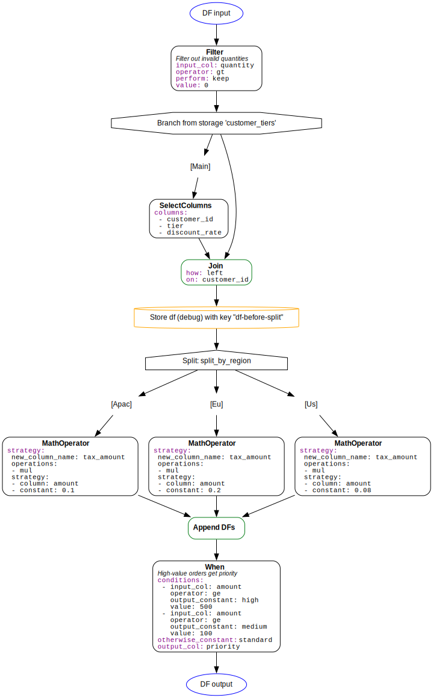

# Nebula

**Declarative data transformation pipelines for Pandas, Polars, and PySpark**

[](https://github.com/nielsen-oss/nebula/actions)
[](https://www.python.org/downloads/)
[](https://opensource.org/licenses/Apache-2.0)
[](https://github.com/astral-sh/ruff)
[](https://github.com/nielsen-oss/nebula)

---

## What is Nebula?

Nebula is a Python library for building **config-driven, multi-backend data pipelines**. Write your transformation logic once, run it on Pandas, Polars, or PySpark.

**Perfect for:**
- 🔧 ETL workflows that need to adapt to different environments
- 📊 Data science teams using multiple DataFrame backends
- 🚀 Production pipelines driven by YAML/JSON configs
- 🔄 Complex data transformations with branching, splitting, and merging

---

## Quick Start

### Installation
```bash
# Clone the repository
git clone https://github.com/nielsen-oss/nebula.git
cd nebula

# Minimal install (Narwhals only)
pip install -e "."

# With specific backend(s)
pip install -e ".[pandas]"
pip install -e ".[polars]"
pip install -e ".[spark]"

# All backends
pip install -e ".[all]"

# With visualization (requires system Graphviz: https://graphviz.org/)
pip install -e ".[viz]"

# For development
pip install -e ".[dev]"
```

### 30-Second Example
```python
import pandas as pd
from nebula import TransformerPipeline
from nebula.transformers import SelectColumns, Filter, Cast

# Define your pipeline
pipeline = TransformerPipeline([
    SelectColumns(columns=["user_id", "amount", "status"]),
    Filter(input_col="status", operator="eq", value="active"),
    Cast(cast={"amount": "float64"}),
])

# Run on any DataFrame backend
df = pd.DataFrame({
    "user_id": [1, 2, 3],
    "amount": ["10.5", "20.0", "15.75"],
    "status": ["active", "inactive", "active"],
})

result = pipeline.run(df)
# Works the same with polars.DataFrame or pyspark.sql.DataFrame!
```

---

## Key Features

### 🎯 Multi-Backend Support
Write once, run on Pandas, Polars, or PySpark. Nebula uses [Narwhals](https://github.com/narwhals-dev/narwhals) for seamless backend abstraction.

### 📝 Config-Driven Pipelines
Define pipelines in YAML/JSON and load them dynamically:
```yaml
pipeline:
  - transformer: SelectColumns
    params:
      columns: [user_id, amount, status]

  - transformer: Filter
    params:
      input_col: status
      operator: eq
      value: active

  - transformer: Cast
    params:
      cast:
        amount: float64
```
```python
from nebula import load_pipeline

pipeline = load_pipeline("config.yaml")
result = pipeline.run(df)
```

### 🌳 Advanced Pipeline Patterns

**Split Pipelines** - Process different subsets differently:
```python
def split_by_status(df):
    return {
        'active': df.filter(pl.col('status') == 'active'),
        'inactive': df.filter(pl.col('status') == 'inactive'),
        'unknown': df.filter(pl.col('status') == 'unknown'),
    }

pipeline = TransformerPipeline(
    {
        'active': [ActiveUserTransforms()],
        'inactive': [InactiveUserTransforms()],
        'unknown': [UnknownStatusTransforms()],
    },
    split_function=split_by_status
)
```

**Branch Pipelines** - Fork processing, then merge back:
```python
pipeline = TransformerPipeline(
    [EnrichmentTransforms()],
    branch={'end': 'join', 'on': 'user_id'},
    otherwise=[MainPipelineTransforms()]
)
```

**Apply to Rows** - Transform only rows matching a condition:
```python
pipeline = TransformerPipeline(
    [HighValueTransforms()],
    apply_to_rows={'input_col': 'amount', 'operator': 'gt', 'value': 100}
)
```

### 🎨 Visualization

Inspect your pipeline structure:
```python
# Text output
pipeline.show(add_params=True)

# Graphviz diagram
pipeline.plot()
```


*Example pipeline visualization showing branching and merging*

### 🔧 Extensible

Create custom transformers by inheriting from `Transformer`:
```python
from nebula.base import Transformer
import narwhals as nw

class MyCustomTransformer(Transformer):
    def __init__(self, *, multiplier: float):
        super().__init__()
        self.multiplier = multiplier

    def _transform_nw(self, df):
        return df.with_columns(
            (nw.col('amount') * self.multiplier).alias('adjusted_amount')
        )
```

---

## Learn More

### 📚 Example Notebooks

Check out the [`example_notebooks/`](example_notebooks/) directory for comprehensive tutorials:

1. **[Flat Pipelines](example_notebooks/01_flat_pipeline.ipynb)** - Basic linear transformations
2. **[Split Pipelines](example_notebooks/02_split_pipeline.ipynb)** - Processing different data subsets
3. **[Branching & Row Operations](example_notebooks/03_branching_and_row_operations.ipynb)** - Advanced control flow
4. **[Storage & Runtime](example_notebooks/04_storage_and_runtime.ipynb)** - Intermediate results and debugging
5. **[Configuration-Driven](example_notebooks/05_configuration_driven.ipynb)** - YAML/JSON pipelines
6. **[Custom Transformers](example_notebooks/06_custom_transformers.ipynb)** - Extending Nebula
7. **[Real-World Example](example_notebooks/07_real_world_example.ipynb)** - Complete ETL workflow
8. **[Spark Debugging](example_notebooks/08_spark_debugging.ipynb)** - PySpark-specific tips

---

## Core Transformers

Nebula includes ~30 tested transformers covering common ETL operations:

### Selection
- `SelectColumns`, `DropColumns`, `RenameColumns` - Column manipulation

### Filtering
- `Filter`, `DropNulls` - Row filtering

### Combining
- `Join`, `AppendDataFrame` - Merging multiple DataFrames

### Reshaping
- `Melt`, `Pivot`, `GroupBy` - DataFrame shape transformations

### Schema & Types
- `Cast`, `AddLiterals` - Type operations

### Validation
- `AssertContainsColumns`, `AssertCount`, `AssertNotEmpty` - Data quality checks

### Collection
- `When`, `MathOperator` - Creating/modifying values

### Meta-Transformers (Escape Hatches)
- `DataFrameMethod` - Call any DataFrame method
- `WithColumns` - Apply column methods in bulk
- `HorizontalFunction` - Cross-column operations

### PySpark-Specific
- `AggregateOverWindow`, `LagOverWindow` - Window functions
- `Repartition`, `Persist`, `Cache` - Performance tuning
- `ColumnsToMap`, `MapToColumns` - Map column operations
- `CpuInfo`, `LogDataSkew` - Debugging
- `SparkSqlFunction`, `SparkColumnMethod` - Meta-transformers

**See the full list:** [`nebula.transformers`](src/nebula/transformers/__init__.py)

---

## Why Nebula?

### Problem: DataFrame Backend Lock-In
You start with Pandas, scale to PySpark, then want to try Polars. Rewriting all your transformation code? Painful.

### Solution: Write Once, Run Anywhere
```python
# Same pipeline works on all three!
pipeline = TransformerPipeline([...])

result_pd = pipeline.run(pandas_df)
result_pl = pipeline.run(polars_df)
result_sp = pipeline.run(spark_df)
```

### Problem: Complex Pipelines Are Hard to Debug
Nested function calls, unclear data flow, no visibility into intermediate steps.

### Solution: Declarative + Inspectable
```python
pipeline.show()  # See the full structure
pipeline.plot()  # Visualize the DAG
# Store intermediate results for debugging
```

### Problem: Hardcoded Logic Doesn't Scale
Different environments need different transformations. Code gets messy fast.

### Solution: Config-Driven
```python
# Load different configs for dev/staging/prod
pipeline = load_pipeline(f"config_{env}.yaml")
```

---

## Requirements

- **Python:** 3.10+
- **Core dependency:** Narwhals ≥2.0.0
- **Optional backends:**
  - Pandas ≥1.2.5
  - Polars ≥1.34.0
  - PySpark ≥3.5.0

---

## Contributing

Contributions welcome! Please open an issue first to discuss major changes.

### Development Setup
```bash
git clone https://github.com/nielsen-oss/nebula.git
cd nebula
pip install -e ".[dev]"
pre-commit install

# Run tests
pytest

# Run linting
pre-commit run --all-files
```

> **Note:** PySpark tests run locally only (CI tests Pandas/Polars).

---

## License

Apache License 2.0 - see [LICENSE](LICENSE) file for details.

---

## Acknowledgments

- Built with [Narwhals](https://github.com/narwhals-dev/narwhals) for multi-backend support
- Inspired by years of production ETL at Nielsen

---

## Project Status

**Current:** Alpha (v0.01) - API may change

**Upcoming:**
- [ ] Sphinx documentation site
- [ ] PyPI publication
- [ ] Type stubs for better IDE support

---

**Made with ❤️ by the Nielsen Data Science Team**
